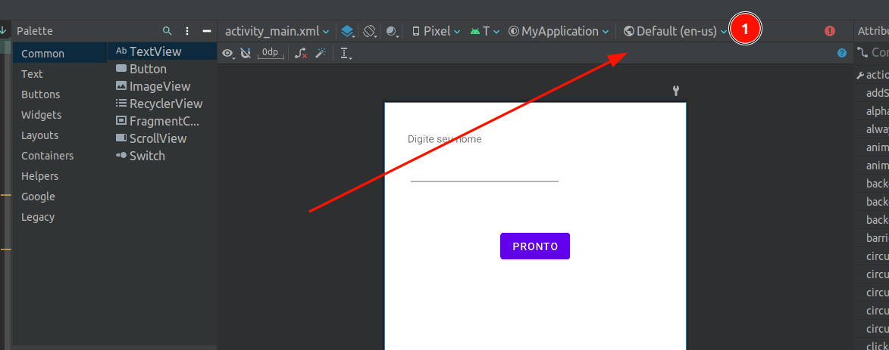
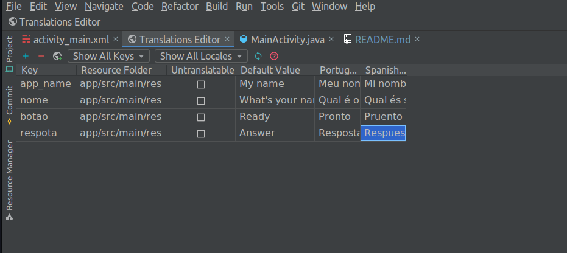

# Andorid
## Ligando codigo java com componentes da view


```java
package com.example.myapplication;

import androidx.appcompat.app.AppCompatActivity;

import android.os.Bundle;
import android.view.View;
import android.widget.EditText;
import android.widget.TextView;

public class MainActivity extends AppCompatActivity {

    EditText nome;
    TextView respota;

    @Override
    protected void onCreate(Bundle savedInstanceState) {
        super.onCreate(savedInstanceState);
        setContentView(R.layout.activity_main);

        nome = (EditText) findViewById(R.id.txtId); // liga a variavel nome ao componente com o id "txtId"
        respota = (TextView) findViewById(R.id.respostaId); // liga a variavel resposta ao componente com o id "respostaId"
    }


}
```

## Definindo Tradções




```java
 public void precionado(View view) {
        String n = nome.getText().toString();
        String frase = getString(R.string.finalizando) + ", "+ n + "!!"; //    getString(R.string.finalizando) serve para importar uma string ja pronta
        respota.setText(frase);
    }
```